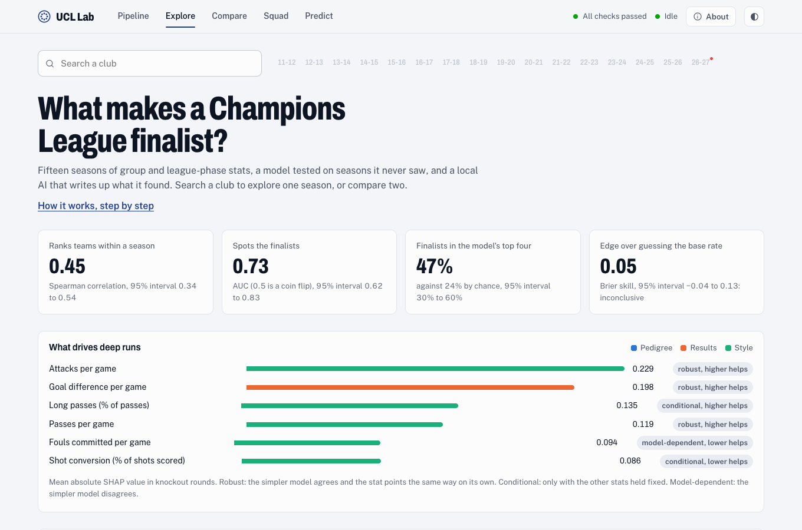
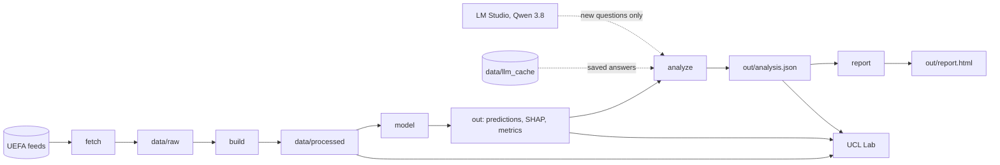
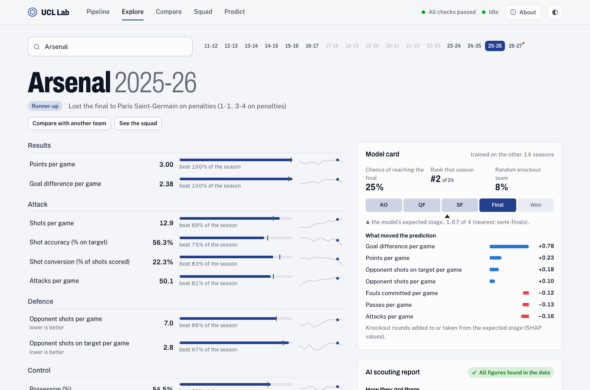
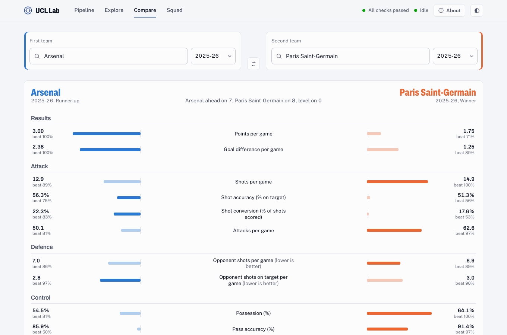
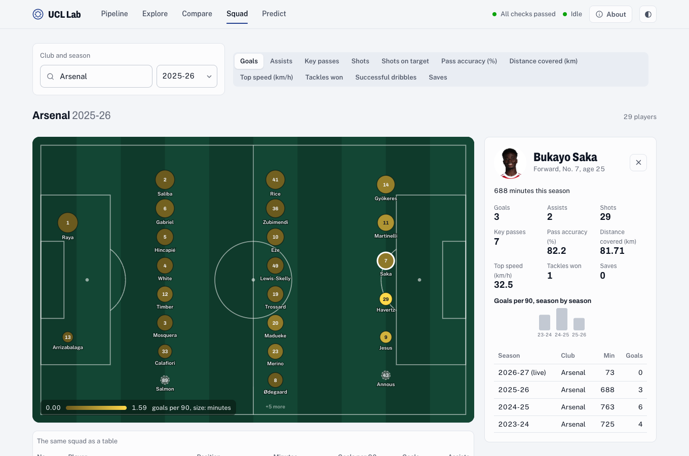
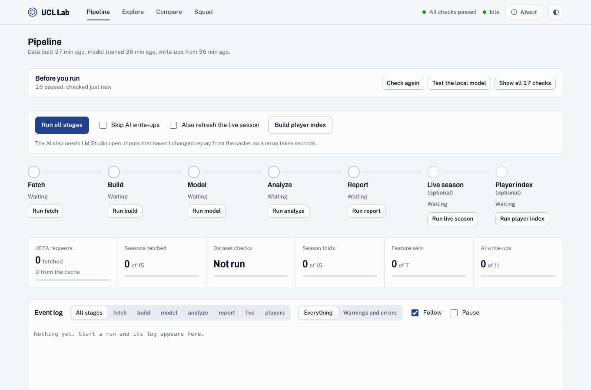
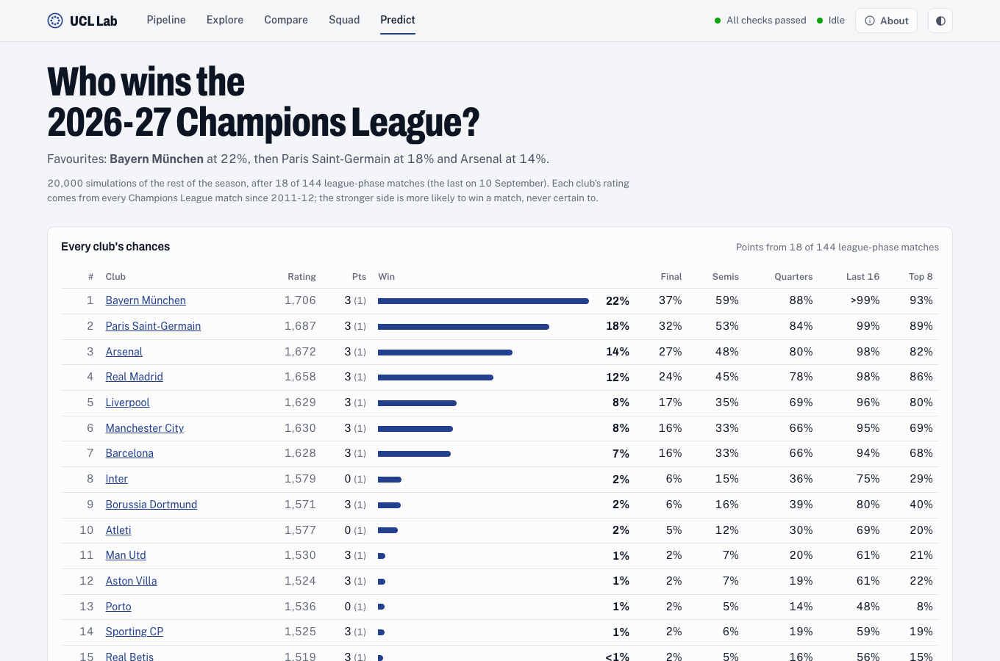

# UCL Finalists

[](https://github.com/SihanCheng0/ucl-finalists/actions/workflows/ci.yml)

What do Champions League finalists have in common? This project collects 15 seasons of UEFA data (2011-12 to
2025-26) and tests which first-phase numbers go with deep knockout runs, on seasons the model never saw. A local
LLM (Qwen 3.8 in LM Studio) then writes a scouting report on each of the 10 finalists of 2022 to 2026. **UCL Lab**,
a local dashboard, lets you explore all of it.



## Quick start

You need [uv](https://docs.astral.sh/uv/getting-started/installation/) (it installs Python 3.13 for you) and
[Node.js](https://nodejs.org/) 22 or newer.

```bash
git clone https://github.com/SihanCheng0/ucl-finalists.git
cd ucl-finalists
make setup   # Python and web dependencies, then the dashboard build
make web     # UCL Lab at http://127.0.0.1:8787, opened in your browser
```

The repo includes all the data: every UEFA response, the built dataset, the model outputs and the saved AI answers.
So the dashboard and the report work right after cloning, with no downloads and no LM Studio. Open
`out/report.html` for the written report. Only the live 2026-27 season and player photos need the internet.

Run `make` to list every command. [CONTRIBUTING.md](CONTRIBUTING.md) explains how we work on the code together.

## What's in the repo

| Path | What it holds |
|-|-|
| [`src/ucl/`](src/ucl) | The pipeline: UEFA client, dataset builder, models, the local-AI analyst and the report |
| [`src/ucl/web/`](src/ucl/web) | The UCL Lab server: FastAPI routes, the pipeline runner, live season, player index and pre-run checks |
| [`web/`](web) | The UCL Lab frontend: Vite, React and TypeScript |
| [`tests/`](tests) | The pytest suite, with golden CLI output in `tests/golden/`. Frontend tests sit beside their code in `web/src/lib/` |
| [`data/raw/`](data/raw) | UEFA's responses, cached: matches, per-match team stats, club coefficients and 524 squads (about 2,100 files) |
| [`data/processed/`](data/processed) | The built dataset: 488 team-seasons with features and labels |
| [`data/llm_cache/`](data/llm_cache) | Every answer the local LLM gave, saved under its exact request, so reruns replay them |
| [`out/`](out) | Model outputs, the AI write-ups (`analysis.json`) and the report |
| [`docs/`](docs) | [How it works](docs/how-it-works.md), the design specs and the implementation plans |
| [`scripts/`](scripts) | Standings check against UEFA, the forecast's tuning and test, and the README screenshots |
| [`tasks/todo.md`](tasks/todo.md) | Build log and review notes |

## How it works



| Stage | What it does | Writes |
|-|-|-|
| fetch | Downloads matches, per-match team stats and club coefficients. Reads the cache first, so it only asks UEFA for what's missing | `data/raw/` |
| build | Turns match stats into 15 per-game features per team-season, converts units UEFA mixed up and fails on implausible values | `data/processed/` |
| model | Leave-one-season-out models of how far each knockout team went, with SHAP explanations and bootstrap intervals | `out/predictions.csv`, `shap.csv`, `drivers.csv`, `ablation.csv`, `finals_compare.csv`, `metrics.json` |
| analyze | The local LLM writes a scouting report per recent finalist and a summary. Every figure is checked against the data | `out/analysis.json` |
| report | One page with the findings, charts and write-ups | `out/report.html`, `out/report_page.html` |

Run every stage with `make pipeline` (`uv run ucl all`), or one at a time with
`uv run ucl fetch | build | model | analyze | report`. Add `--no-ai` to skip the write-ups, or
`--llm-model KEY` to use another LM Studio model.

**Do I need LM Studio?** Only for new AI write-ups. Analyze tries the saved answers in `data/llm_cache/` first.
If every question has been asked before, it rebuilds the write-ups without LM Studio. If the facts have changed
(new data, a different model), it starts LM Studio's server and loads `qwen/qwen3.8-27b` with a 16,384-token
context. That needs LM Studio with its `lms` command line tool.

[docs/how-it-works.md](docs/how-it-works.md) walks through the whole process in plain language.

## UCL Lab, the dashboard

`make web` serves it on 127.0.0.1 only. `uv run ucl web --port N` changes the port, `--no-open` skips opening
the browser and `--llm-model KEY` picks the model for the analyze stage. **About**, in the top bar, explains
the process and how to read each screen.

| Explore | Compare |
|-|-|
|  |  |
| Search any club, pick a season and see the share of that season's teams it beat on each stat, with its trend, the model card and the AI scouting report. Nicknames like "PSG" or "Barca" work. | Two team-seasons from any seasons. First who would win if they met (one match, two legs, a final) and which club is likelier to win this season's Champions League, then stat by stat: each bar is the team's distance from its own season's average, so different eras compare fairly. |

| Squad | Pipeline |
|-|-|
|  |  |
| The squad on the pitch. Circles grow with minutes and glow with the chosen stat, per 90 for counts. Pick a player for their numbers at every club since 2011-12. | Run every stage or one at a time and watch it live. **Before you run** checks LM Studio, the UEFA feeds, the saved data and the dashboard build, and says how to fix anything that isn't ready. |

| Predict | |
|-|-|
|  | Who wins the 2026-27 Champions League: each club's chance of reaching every round, from 20,000 simulations of the rest of the season. Below it, a head-to-head between any two team-seasons (one match, a two-legged tie and a final) and how well these odds did on past seasons. Compare shows the same head-to-head for its two teams. |

The live season (2026-27) is built in memory from UEFA's feeds, refreshed every six hours and never used to train
the model. Squads are cached in `data/raw/players/`.

## Results

| Measure | Value | 95% interval |
|-|-|-|
| Ranking teams within a season (Spearman) | 0.45 | 0.34 to 0.54 |
| Spotting the finalists (AUC) | 0.73 | 0.61 to 0.83 |
| Brier skill against the base rate | 0.05 | -0.04 to 0.13, so inconclusive |
| Finalists in the predicted top four | 47% | 30% to 60%, against 24% for a random ranking |

Group-stage play only modestly predicts deep runs. Attacks, goal difference and passes per game are the robust
drivers. Pedigree adds little once play is known, though the intervals overlap. 3 of the 10 recent finalists were
the model's top-two pick in their season.

## Method

- **Target.** Training uses the 256 team-seasons that reached the knockouts. The target is how far each went:
  0 for out before the quarter-finals, 1 for the quarter-finals, 2 for the semi-finals, 3 for losing the final
  and 4 for winning it.
- **Inputs.** 15 per-game stats from group and league-phase matches only, z-scored within each season. They fall
  into three groups: pedigree (the pre-season UEFA club coefficient), results and style. A stat is kept only if at
  least 90% of matches report it, which drops save rate: the 2011-12 feed lacks saves for too many matches.
- **Cleaning.** For some 2014-16 matches, UEFA's feed gives possession in seconds and distance in metres. These
  are converted. Partial tracking (a match distance under 80 km) and placeholder zeros are masked. Steaua's
  match-feed id is aliased to FCSB. A plausibility check fails the build on out-of-range season averages.
- **Models.** Two models, each validated leave-one-season-out over 15 folds. Gradient boosting predicts the
  stage, and exact TreeSHAP explains each prediction. An L2 logistic regression predicts reaching the final; its
  probabilities are scaled within each season to sum to two.
- **Uncertainty.** 95% intervals come from resampling seasons (1,000 bootstrap draws).
- **Driver labels.** The top 6 stats by mean |SHAP| each get one label. *Robust:* the logistic model agrees on
  the direction in at least 12 of 15 seasons, and the stat points the same way on its own. *Conditional:* the
  direction holds only with the other stats held fixed. *Model-dependent:* the logistic model disagrees too often.
- **Winners vs runners-up.** Sign tests over the 15 finals, with a Holm adjustment across the 15 stats.
- **Predictions.** Elo ratings from every Champions League match, pulled toward the club coefficient each season, feed
  a Poisson goals model with one version per stage: the deeper the round, the less a rating gap counts. Title odds
  come from 20,000 simulations of the rest of the season under UEFA's format. Tuned on 2013-14 to 2018-19 and tested on
  the seven seasons after: the likeliest result happened in 58% of matches, and the eventual winner had 11% on average
  when the knockouts began, against 6% for a random pick. [How it works](docs/how-it-works.md#predictions).
- **Local AI.** The LLM sees only a plain-English fact sheet. Each answer is checked for its structure, for
  numbers that aren't in the facts and for wording slips: significance words in team reports, length, the wrong
  name for the first phase, or the final placed inside it. One retry fixes what it can, and the better answer is
  kept. The report shows a badge for the number check.

## Caveats

These are associations, not causes. Knockouts are noisy, and 15 seasons hold only 30 finalists. UEFA publishes no
xG for these seasons, and its APIs are undocumented. The report lists every caveat.

## Development

```bash
make test       # pytest, then the frontend tests (Vitest)
make dev        # frontend hot reload on :5173; run `uv run ucl web --no-open` alongside it
```

`uv run python scripts/check_standings.py` checks the finalists' points and goal difference against UEFA's
standings. CI runs both test suites and the frontend build on every pull request and every push to `main`. See
[CONTRIBUTING.md](CONTRIBUTING.md) for the workflow, golden files and how to handle the data.

## Docs

- [How it works](docs/how-it-works.md): the whole process in plain language
- [Pipeline and model design](docs/specs/2026-10-01-ucl-finalists-design.md) and its
  [implementation plan](docs/plans/2026-10-01-ucl-finalists.md)
- [UCL Lab design](docs/specs/2026-10-01-ucl-lab-dashboard-design.md) and its
  [implementation plan](docs/plans/2026-10-01-ucl-lab-plan-a.md)

## License

The code is released under the [MIT License](LICENSE). The UEFA data in `data/raw/` comes from UEFA's public feeds
and isn't covered by that license: UEFA's terms apply to it. Player photos load from UEFA's servers and aren't part of
the repo.
