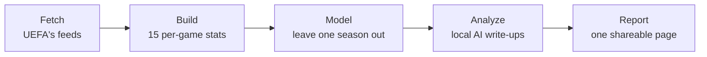

# How it works

The project asks one question: what do Champions League finalists have in common? It collects 15 seasons of UEFA
data (2011-12 to 2025-26), learns which first-phase numbers go with deep knockout runs, tests that on seasons it
never saw, and has a local AI explain the result. This page follows that process from start to end. The
**About** panel in UCL Lab tells the same story.

## The pipeline

### 1. Fetch

Every Champions League match, each team's stats from every first-phase match, and the UEFA club coefficients,
all from UEFA's public feeds. Everything is saved in `data/raw/`, so later runs work offline and only fetch what's
new. The repo already holds every response, so a fresh clone needs no downloads.

Code: `src/ucl/uefa.py` (the client and its cache), `src/ucl/dataset.py` (what to fetch).

### 2. Build

Match stats become 15 per-game numbers for each team-season, in three groups:

- **results:** points and goal difference
- **style:** shots, possession, passing, distance and fouls
- **pedigree:** the club coefficient before the season

Units UEFA mixed up are converted, partial tracking is ignored, and a plausibility check stops the build if a value
looks impossible. Each number is then compared with the rest of that season's field (a z-score), so different eras
are measured fairly. The result is 488 team-seasons in `data/processed/`.

Code: `src/ucl/features.py`, `src/ucl/labels.py`, `src/ucl/dataset.py`.

### 3. Model

Only the 256 teams that reached the knockouts are used, and the target is how far each went, from the first
knockout round to the trophy. The model trains on 14 seasons and predicts the 15th, rotating until every season has been
predicted blind (leave-one-season-out). Two models run side by side:

- **Gradient boosting** estimates how far a team goes. SHAP values show which stats moved each prediction.
- **Logistic regression**, a simpler model, gives each team's chance of reaching the final.

Resampling whole seasons (1,000 bootstrap draws) gives a 95% interval for every headline figure. A stat counts as
a *robust* driver only if the simpler model agrees on its direction in at least 12 of 15 seasons and it points
the same way on its own.

Code: `src/ucl/model.py`. Outputs: `out/predictions.csv`, `shap.csv`, `drivers.csv`, `metrics.json` and more.

### 4. Analyze

A local AI model, Qwen 3.5 running in LM Studio on your computer, writes a scouting report on each finalist of 2022
to 2026 and a summary of the findings. It sees only a fact sheet of the numbers, never the internet.

Every figure it writes is checked against the facts, and so is its wording: the right name for the first phase
(group stage until 2023-24, league phase from 2024-25), no significance claims in team reports, and a word limit. An
answer with a slip gets one retry, and the better answer is kept. The badge on each report says whether all its
figures were found.

Every answer is saved in `data/llm_cache/` under its exact question. Analyze replays saved answers first, so it
needs LM Studio only when a question is new: when the data or the model has changed.

Code: `src/ucl/facts.py` (the fact sheets), `src/ucl/analyst.py` (prompts and retries), `src/ucl/grounding.py`
(the checks), `src/ucl/llm.py` (LM Studio and the cache). Output: `out/analysis.json`.

### 5. Report

Everything above is written into one shareable page, `out/report.html`: the same findings you can explore in
UCL Lab.

Code: `src/ucl/report.py`, `src/ucl/charts.py`.

### Beside the pipeline

- **Live season** builds 2026-27 from the matches finished so far, refreshed every six hours. It's shown for
  comparison only and never used to train the model.
- **Player index** downloads every squad since 2011-12 (524 tables), so a player's seasons line up across all
  their clubs.

## Reading the screens

- **Pipeline** shows each stage as it runs, with live counters and the log. *Before you run* checks LM Studio,
  UEFA and the saved data first.
- **Explore:** each bar is the share of that season's teams this one did better than, so a longer bar is always
  better, even for stats where lower wins. The small tick marks the same share against every team since 2011-12.
  The line beside it traces that share across the club's seasons.
- **Model card:** the chance of reaching the final, the team's rank that season, and a ladder from the knockout
  round to the trophy. The ▲ is where the model expected the team to finish.
- **Compare:** each bar is how far a team was from its own season's average. The middle of each track is average,
  and better always points outward.
- **Squad:** circles grow with minutes played and glow brighter with the stat you pick. Counts are per 90 minutes,
  so substitutes and starters compare fairly.

## What it found

First-phase play only modestly predicts deep runs. Within a season, the model's ranking correlates 0.45 with how
far teams really went, and it separates finalists from the rest with an AUC of 0.73. 47% of finalists were in its
top four, against 24% by chance. Its edge over simply guessing the base rate is inconclusive. The stats that hold
up most consistently: attacks, goal difference and passes per game.

## Keep in mind

- These are associations, not causes, and first-phase numbers depend on who a team was drawn against.
- Knockout football is noisy, and 15 seasons hold only 30 finalists.
- UEFA publishes no expected-goals data for these seasons, and its feeds are used as published.
- Live-season figures are early: one result moves them a long way until all first-phase matches are played.
